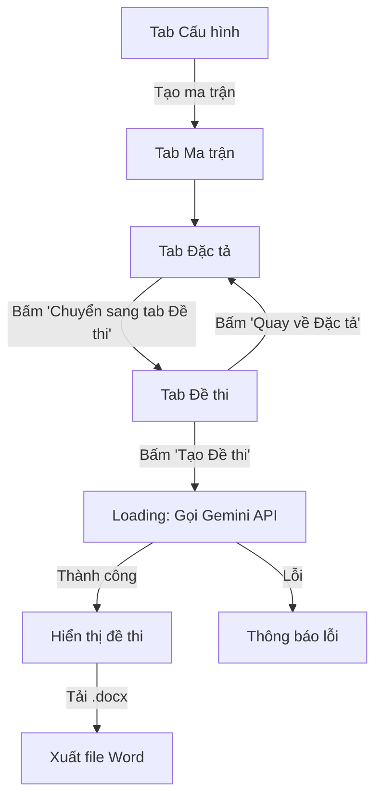

# Tạo Tab "Đề Thi" - Tạo đề thi bằng Gemini API

## Mô tả
Thêm chức năng tạo đề thi tự động bằng Gemini API vào tab "Đề thi" trong các trang đề thi THPT. Khi bấm nút "Tạo Đề thi", hệ thống sẽ gọi API Gemini 2.5 Pro để sinh đề thi dựa trên dữ liệu ma trận và đặc tả đã cấu hình. Từ tab Đặc tả, bấm "Chuyển sang tab Đề thi" sẽ chuyển sang tab Đề thi.

## Cần xác nhận từ bạn

> [!IMPORTANT]
> **API Key Gemini**: Bạn cần cung cấp API Key của Gemini để tích hợp. Tôi sẽ sử dụng placeholder `YOUR_GEMINI_API_KEY` cho đến khi bạn cung cấp.

> [!IMPORTANT]
> **Model Gemini**: Bạn muốn dùng model nào? Gemini 2.5 Pro (`gemini-2.5-pro`) hay Gemini 2.0 Flash (`gemini-2.0-flash`)? Bạn đề cập "Gemini 3.1 pro" nhưng model đó không tồn tại - có thể bạn muốn nói Gemini 2.5 Pro?

## Thay đổi đề xuất

### Tất cả các trang đề thi (10 trang)

Mỗi trang sẽ được cập nhật với các thay đổi tương tự:

#### CSS mới
- Thêm styles cho tab "Đề thi" (`content-dethi`):
  - Container với giao diện xem trước đề thi
  - Nút "Tạo Đề thi" với animation loading
  - Nút "Quay về Đặc tả" để quay lại tab Đặc tả
  - Nút "Tải về .docx" để xuất đề thi
  - Khu vực hiển thị đề thi (rendered markdown → HTML)
  - Loading overlay với spinner animation
  - Thiết kế premium: gradient backgrounds, glassmorphism, micro-animations

#### HTML mới - Tab Đề thi (`content-dethi`)
```
┌─────────────────────────────────────────────┐
│ 📝 ĐỀ THI [MÔN HỌC]                       │
│ Tạo bởi AI · Dựa trên ma trận + đặc tả     │
├─────────────────────────────────────────────┤
│ [🔙 Quay về Đặc tả] [🤖 Tạo Đề thi -3đ]  │  
│                      [📥 Tải về .docx]      │
├─────────────────────────────────────────────┤
│                                             │
│  ┌─────────────────────────────────────┐    │
│  │  Thông tin đề thi                   │    │
│  │  Trường: ...  Môn: ...  Thời gian:. │    │
│  ├─────────────────────────────────────┤    │
│  │                                     │    │
│  │  I. TRẮC NGHIỆM NHIỀU LỰA CHỌN    │    │
│  │  Câu 1: ...                         │    │
│  │  A. ...  B. ...  C. ...  D. ...     │    │
│  │                                     │    │
│  │  II. ĐÚNG/SAI                       │    │
│  │  ...                                │    │
│  │                                     │    │
│  │  III. TRẢ LỜI NGẮN                 │    │
│  │  ...                                │    │
│  │                                     │    │
│  │  IV. TỰ LUẬN                       │    │
│  │  ...                                │    │
│  └─────────────────────────────────────┘    │
│                                             │
└─────────────────────────────────────────────┘
```

#### JavaScript mới
1. **`generateExamWithAI()`** - Hàm chính:
   - Thu thập toàn bộ config từ tab Cấu hình (thông tin đề, số câu, điểm, mức độ nhận thức)
   - Thu thập dữ liệu ma trận + đặc tả đã tạo
   - Xây dựng prompt chi tiết cho Gemini API
   - Gọi API Gemini qua `fetch()` (REST API)
   - Parse kết quả và hiển thị đề thi
   
2. **`buildExamPrompt()`** - Tạo prompt:
   - Bao gồm thông tin môn học, cấu trúc đề
   - Chi tiết số câu từng loại (TN nhiều lựa chọn, Đúng/Sai, Trả lời ngắn, Tự luận)
   - Mức độ nhận thức (Biết/Hiểu/Vận dụng) theo tỉ lệ %
   - Danh sách chủ đề/đơn vị kiến thức đã chọn
   - Yêu cầu format output cụ thể

3. **`renderExam(examHTML)`** - Hiển thị đề thi
4. **`exportExamToDocx()`** - Xuất đề thi ra .docx

### Luồng hoạt động



## Câu hỏi mở

1. **API Key**: Bạn vui lòng cung cấp API key Gemini?
2. **Model**: Bạn muốn dùng model nào của Gemini? (2.5 Pro, 2.0 Flash, etc.)
3. **Áp dụng cho tất cả môn**: Bạn muốn tôi cập nhật cả 10 trang đề thi cùng lúc hay chỉ 1-2 trang trước?

## Kế hoạch xác minh

### Kiểm tra tự động
- Mở trang trong trình duyệt
- Kiểm tra tab switching hoạt động đúng
- Kiểm tra nút "Quay về Đặc tả" từ tab Đề thi chuyển đúng tab

### Kiểm tra thủ công  
- Test gọi API Gemini thực tế (cần API key)
- Kiểm tra đề thi hiển thị đúng format
- Test xuất .docx
