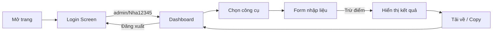

# Chuyển đổi Website thành Ứng dụng Web Hoạt động

## Mục tiêu
Chuyển từ landing page tĩnh → ứng dụng web có dashboard với các công cụ AI giáo dục **thực sự hoạt động**, mô phỏng theo giao diện dashboard trong ảnh.

## Cấu trúc sau khi đăng nhập

Sau khi đăng nhập (`admin / Nha12345`), người dùng vào **Dashboard** thay vì landing page.

### Dashboard bao gồm:

```
Header: Logo | Trang chủ | Nạp điểm | Hướng dẫn | ⓧ 100 điểm | 🔔 | Admin ▾
```

---

### Các nhóm công cụ (theo ảnh mẫu)

| # | Nhóm | Công cụ | Điểm/lần |
|---|-------|---------|----------|
| 1 | **SÁNG KIẾN KINH NGHIỆM** | SKKN (Tự động), SKKN (Dàn ý riêng), SKKN (TT 18/BKHCN) | -15 |
| 2 | **GIÁO ÁN MẦM NON** | Giáo án Mầm non, Hoạt động học, Hoạt động ngoài trời, Hoạt động góc | -4, -2 |
| 3 | **Soạn giáo án Tiểu học, THCS, THPT** | KHBD 3 Cột (2345), KHBD Trung học 5512, KHBD DGNL 1001, Tích hợp năng lực, Tự động tích hợp | -4 |
| 4 | **ĐỀ THI 7991 THPT** | Toán, Vật Lí, Hóa học, Sinh Học, Ngữ Văn, Lịch Sử, Địa Lí, KTPL | -5 |
| 5 | **ĐỀ THI 7991 THCS & TIỂU HỌC** | TH & THCS từ SGK, English Exam, Từ đề cương, Từ ma trận | -8~10 |
| 6 | **SẮP RA MẮT** *(greyed out)* | Tạo bài trắc nghiệm, Đưa thuyền rồng, Tạo phiếu bài tập... | — |

---

## Proposed Changes

### 1. Cấu trúc file mới

#### [NEW] [dashboard.html](file:///C:/Users/thanh/.gemini/antigravity/scratch/dashboard.html)
- Trang dashboard chính sau khi đăng nhập
- Header mới với: điểm, thông báo, avatar, đăng xuất
- Grid các nhóm công cụ với icon + badge điểm
- Mỗi công cụ click → mở modal/form nhập liệu

#### [NEW] [tool.html](file:///C:/Users/thanh/.gemini/antigravity/scratch/tool.html)
- Trang sử dụng công cụ (form nhập → kết quả)
- Form nhập tùy theo công cụ (môn, lớp, chủ đề, bài học...)
- Khu vực hiển thị kết quả (nội dung được tạo từ template)
- Nút tải về Word/PDF (xuất nội dung dạng text)

#### [MODIFY] [script.js](file:///C:/Users/thanh/.gemini/antigravity/scratch/script.js)
- Thêm hệ thống điểm (bắt đầu 100 điểm)
- Logic chuyển trang: Login → Dashboard → Tool
- Mỗi lần dùng công cụ → trừ điểm
- Tạo nội dung template cho từng loại công cụ

#### [MODIFY] [style.css](file:///C:/Users/thanh/.gemini/antigravity/scratch/style.css)
- CSS cho dashboard layout
- CSS cho tool cards, point badges
- CSS cho tool form và result area

#### [KEEP] [index.html](file:///C:/Users/thanh/.gemini/antigravity/scratch/index.html)
- Giữ nguyên trang login (login → redirect dashboard.html)

---

### 2. Cách các công cụ hoạt động

Vì không có backend AI thật, các công cụ sẽ:

1. **Form nhập liệu**: Người dùng nhập thông tin (môn học, lớp, tên bài, chủ đề...)
2. **Trừ điểm**: Trừ số điểm tương ứng
3. **Tạo nội dung từ template**: Sử dụng JavaScript template literals để tạo nội dung giáo án/SKKN/đề thi có cấu trúc chuyên nghiệp dựa trên thông tin đã nhập
4. **Hiển thị kết quả**: Nội dung hiển thị ngay trên trang
5. **Xuất file**: Nút "Tải về" để copy hoặc lưu nội dung

> [!IMPORTANT]
> Nội dung tạo ra sẽ là template có cấu trúc chuẩn (không phải AI thật). Nếu muốn tích hợp AI thật (GPT/Gemini API), cần có backend server và API key - tôi có thể thêm sau.

---

### 3. Flow người dùng



---

## Open Questions

> [!IMPORTANT]
> 1. **Bạn có muốn tích hợp API AI thật** (như Google Gemini API) để tạo nội dung thật sự? Nếu có, cần API key.
> 2. **Số điểm ban đầu** khi đăng nhập là bao nhiêu? (Mặc định: 100 điểm)
> 3. **Bạn có muốn giữ lại phần landing page** (hero, sản phẩm, doanh nghiệp, chính sách) hay chỉ cần Login → Dashboard?

## Verification Plan

### Automated Tests
- Mở trình duyệt kiểm tra flow: Login → Dashboard → Chọn tool → Nhập form → Xem kết quả → Đăng xuất
- Kiểm tra hệ thống điểm (trừ đúng, không cho dùng khi hết điểm)

### Manual Verification  
- So sánh giao diện dashboard với ảnh mẫu
- Kiểm tra responsive trên mobile
